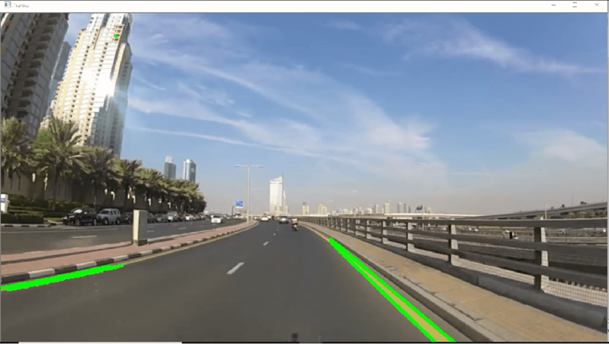

# Line Detection on Road with OpenCV
This repository contains a Python script that demonstrates line detection in a video using OpenCV. The script processes a video file to detect and highlight lines, which can be useful for applications such as lane detection in autonomous driving.

# Overview
The script reads a video file, applies Gaussian blur and color filtering to isolate specific features, and then uses the Canny edge detector and Hough Line Transform to detect and draw lines on the video frames.

# Features
  ### Video Processing:
  Reads and processes video frames in real-time.
  ### Gaussian Blur:
  Reduces noise and smoothens the image.
  ### Color Filtering:
  Isolates specific color ranges in the HSV color space.
  ### Edge Detection:
  Uses the Canny edge detector to find edges in the image.
  ### Line Detection:
  Applies the Hough Line Transform to detect and draw lines.

# Installation
 1. Clone the repository:
    ```bash
    git clone https://github.comcizodevahm/line-detection-on-road-with-OpenCV.git
    ```
2. Navigate to the project directory:
   ```bash
   cd line-detection-on-road-with-OpenCV
   ```
3. Install the required dependencies:
   ```bash
   pip install opencv-python numpy
   ```
# Usage
 1. Place your video file in the project directory and update the script with the video file name.
 2. Run the script:
    ```bash
    python Line.py
    ```
3. The script will display the processed video with detected lines.

# Example

